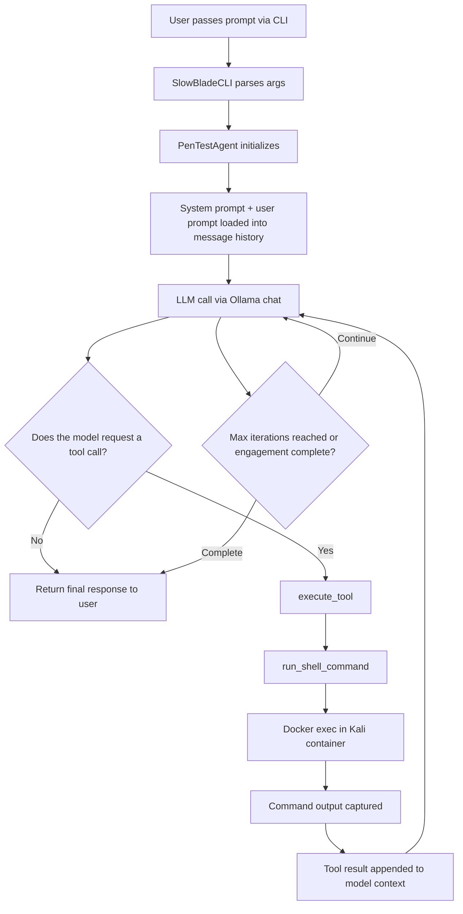

# Slow-Blade

Slow-Blade is an agentic penetration testing and reconnaissance CLI that runs commands inside a Kali-based Docker container.
This is just a fun, novelty project and personal exercise that I figured I'd share.
I recommend checking out [github.com/0xSteph/pentest-ai-agents](https://github.com/0xSteph/pentest-ai-agents) if you need something serious.
With that being said, this has proven to be somewhat effective for busywork like active recon and attack surface mapping.

-----

`(Tested on Windows 11 / Docker Desktop - RTX 2080 SUPER w/ qwen3:8b)`

> [!CAUTION]
> *This is not meant to be used for illegal activity, and should only be used in a sandbox or for controlled CTF excercises. I, as the developer, hold no responsibility for how you use this.*


## Install

First, make sure you have [Ollama](https://ollama.com/download) installed.

From the project root:

```bash
python -m pip install -e .
```

## Usage

```bash
slowblade --help
slowblade --prompt "Do some recon on mysandboxed.website"
```

You can also override the model and container:

```bash
slowblade --prompt "Do some recon on mysandboxed.website" --model qwen3:8b --docker-container kali
```

If you want to see the model's reasoning while it works, enable `--show-thinking`:

```bash
slowblade --prompt "Do some recon on mysandboxed.website" --show-thinking
```

You can also tune the model with `--model-options` and cap the tool loop with `--max-iterations`:

```bash
slowblade --prompt "Do some recon on mysandboxed.website" --model qwen3:8b --docker-container kali --model-options '{"temperature": 0.5}' --max-iterations 20 --show-thinking
```

## Model Flow


